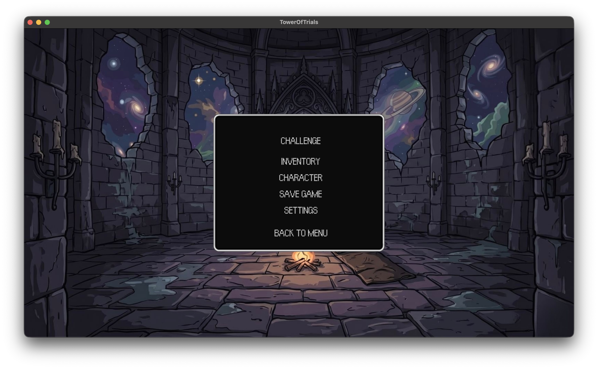
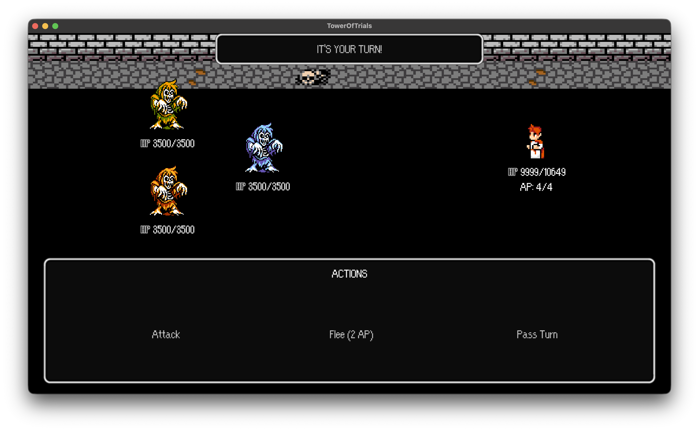
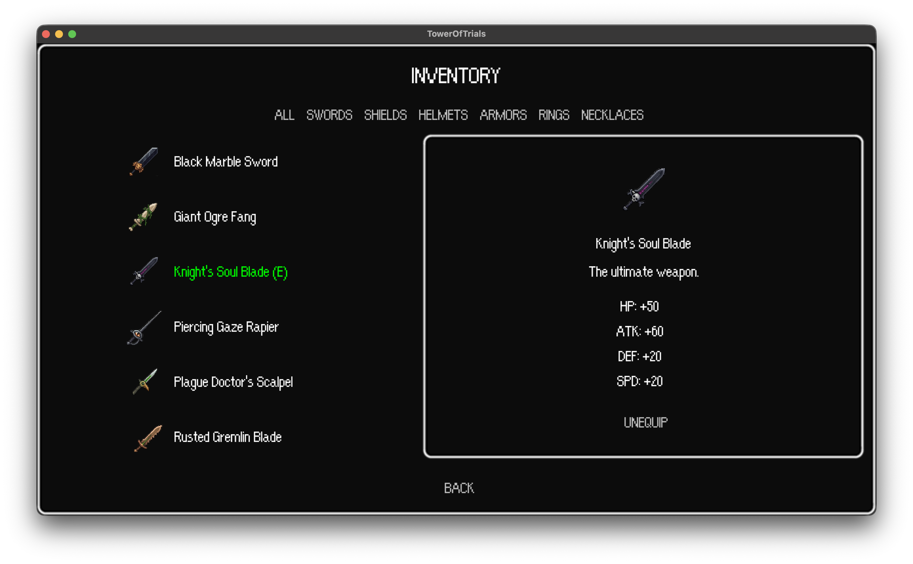
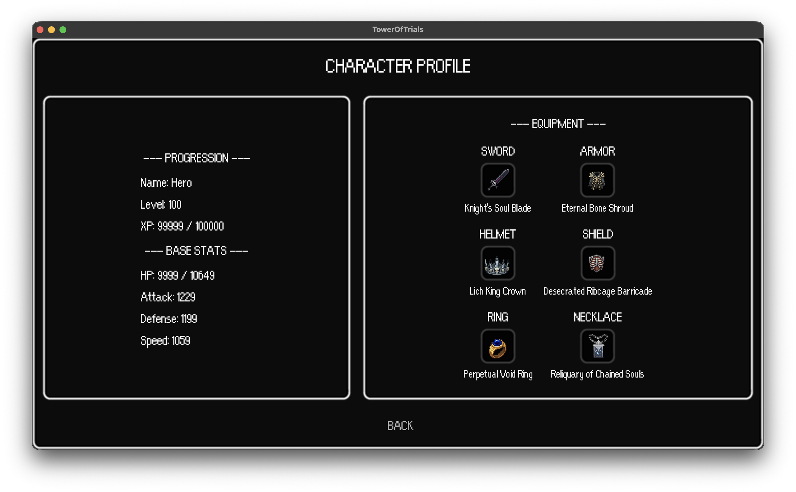

# 🏰 Tower of Trials

**Tower of Trials** é um RPG Tático de Turnos "UI-Driven" com uma estética retrô fortemente inspirada nos sistemas clássicos como o Commodore 64 e interfaces minimalistas. 

Em vez de focar em exploração de mapas e andanças intermináveis, *Tower of Trials* corta diretamente para a ação estratégica. Você gerencia seus Pontos de Ação (AP), habilidades e inventário através de uma interface limpa e imersiva para enfrentar hordas de monstros e chefes implacáveis em uma torre de 8 andares.

---

## 📸 Screenshots

<p align="center">
  
  
</p>
<p align="center">
  
  
</p>

---

## ⚔️ Sobre o Jogo

Você foi "invocado" como um Contratante em uma torre que serve como purgatório. Para recuperar sua mortalidade, você deve ascender até o topo.

### Mecânicas Principais:
- **Combate Assimétrico**: O jogador é poderoso e possui até 4 Pontos de Ação (AP) por turno, permitindo combos e múltiplas ações. Os inimigos, por outro lado, são numerosos mas possuem ações limitadas.
- **Progressão Linear**: O jogo se divide em andares (biomas). Cada andar possui Dungeons (para *farm* de níveis e equipamentos) e uma Boss Room. Não é possível retornar a um andar depois de vencer seu chefe!
- **Loots e Atributos**: Colete armas, armaduras, escudos e anéis. Gerencie sua defesa, velocidade (`Speed` define a ordem dos turnos) e saúde.
- **Habilidades Permanentes**: Derrotar os chefes da torre concede Habilidades únicas e feitiços para usar na sua escalada.

---

## 💻 Tecnologias e Arquitetura

Este jogo foi desenvolvido focado em ser leve, rápido e extensível.

- **Linguagem**: Java 17+
- **Game Engine**: [LibGDX](https://libgdx.com/) (Lwjgl3)
- **Interface Gráfica**: [VisUI](https://github.com/kotcrab/vis-ui) (UI customizada temática)
- **Arquitetura de Dados**: [Ashley ECS](https://github.com/libgdx/ashley) (Entity Component System) para o sistema de combate, unificado com um modelo de domínio rígido (`GameEntity`, `Player`, `Enemy`).
- **Build System**: Gradle

---

## 🎮 Onde Roda?

O jogo foi otimizado como uma aplicação Desktop *standalone*.
- **Plataformas**: Windows, macOS, Linux.
- **Controles**: 100% Mouse (Point-and-Click).
- **Resolução Nativa**: 1280x720 (suporta redimensionamento e tela cheia).

---

## 🛠️ Como Jogar / Instalar

### 🎮 Baixando o Executável (Recomendado)
A maneira mais fácil de jogar é baixando a versão mais recente da **v1.0.0** diretamente na nossa página de **[Releases](../../releases/latest)**. 
Lá você encontrará os arquivos nativos e empacotados para:
- **Windows** (`.exe`)
- **Linux** (Nativo)
- **macOS** (Intel e Apple Silicon/M1)

Basta baixar o arquivo `.zip` correspondente ao seu sistema, extrair e executar o jogo. Não é necessário instalar o Java!

---

### 💻 Compilando do Código-Fonte
Se você for um desenvolvedor e quiser rodar ou compilar o jogo diretamente do código-fonte, precisará do **Java 17 (JDK)** instalado na sua máquina.

#### Executando o Jogo Localmente
Você pode executar o jogo rapidamente através do terminal utilizando o Gradle Wrapper:

**Windows**:
```bat
gradlew.bat lwjgl3:run
```

**macOS / Linux**:
```bash
./gradlew lwjgl3:run
```

#### Gerando um .JAR Executável
Para gerar um arquivo `.jar` cruzado:

**Windows**:
```bat
gradlew.bat lwjgl3:jar
```

**macOS / Linux**:
```bash
./gradlew lwjgl3:jar
```
O executável `.jar` estará disponível na pasta: `lwjgl3/build/libs/`.

---

## 📜 Licença e Créditos

Um agradecimento especial aos incríveis artistas que disponibilizaram seus assets gratuitamente, tornando a construção deste MVP possível:

- [**Terra Mother UI**](https://github.com/czyzby/gdx-skins/tree/master/terra-mother) by Raymond "Raeleus" Buckley
- [**Pixel Art VFX - Priest**](https://frostwindz.itch.io/pixel-art-vfx-priest) by Frostwindz
- [**Pixel Art VFX - Impacts**](https://frostwindz.itch.io/pixel-art-vfx-impacts-free-version) by Frostwindz
- [**Mythic Monsters**](https://willibab.itch.io/free-mythic-monsters) by Willibab
- [**Willibab's Pixel Battle Backgrounds**](https://willibab.itch.io/willibabs-free-pixel-battle-backgrounds) by Willibab

### Ferramentas e Tecnologias
Este jogo foi desenvolvido inteiramente em **Java** e utiliza as seguintes tecnologias:
- [**LibGDX**](https://libgdx.com/) - Engine base para renderização e gerenciamento do ciclo de vida.
- [**Ashley ECS**](https://github.com/libgdx/ashley) - Framework de Entity-Component-System para gerenciamento da lógica de combate.
- [**VisUI**](https://github.com/kotcrab/vis-ui) - Biblioteca para interfaces gráficas complexas sobre o Scene2D.
- [**Construo**](https://github.com/fourlastor/construo) - Ferramenta de empacotamento para gerar os executáveis nativos (Windows, Mac, Linux).
